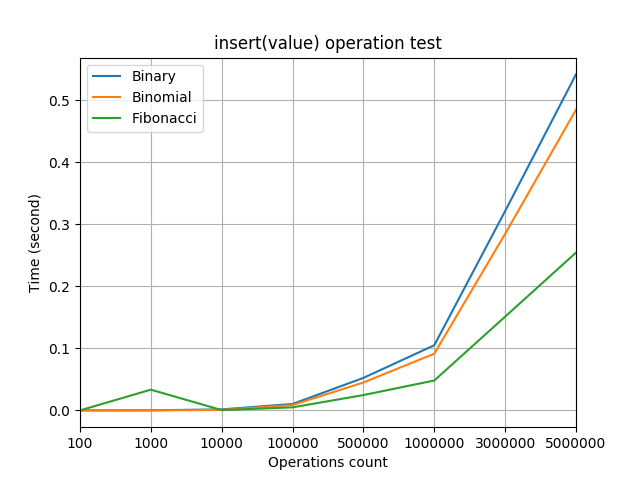
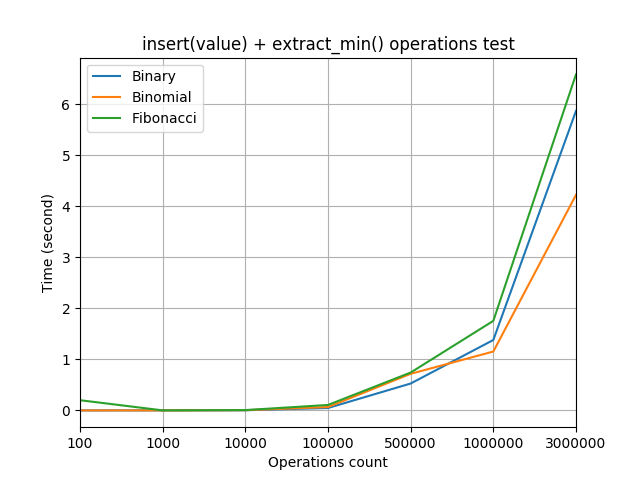
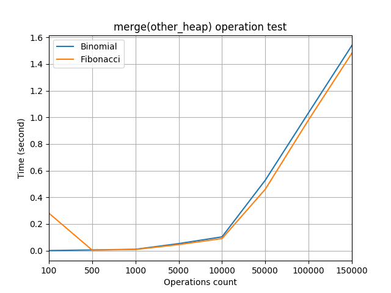
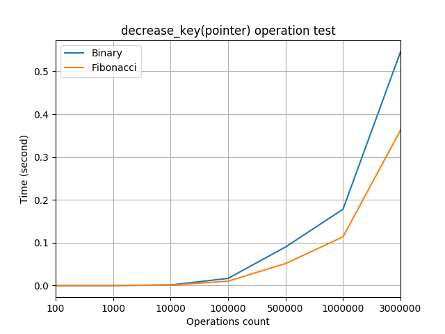
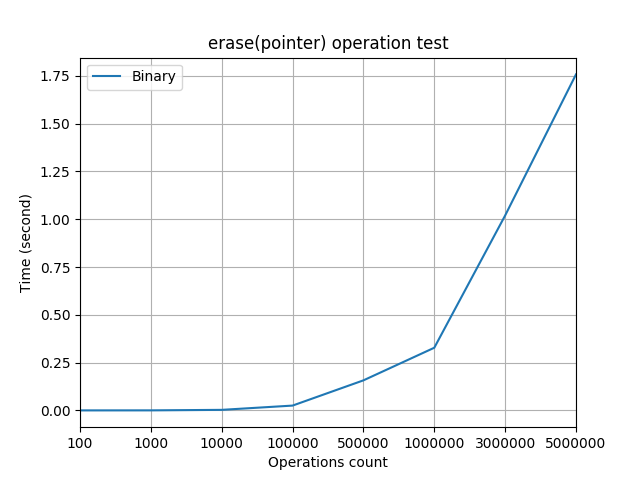
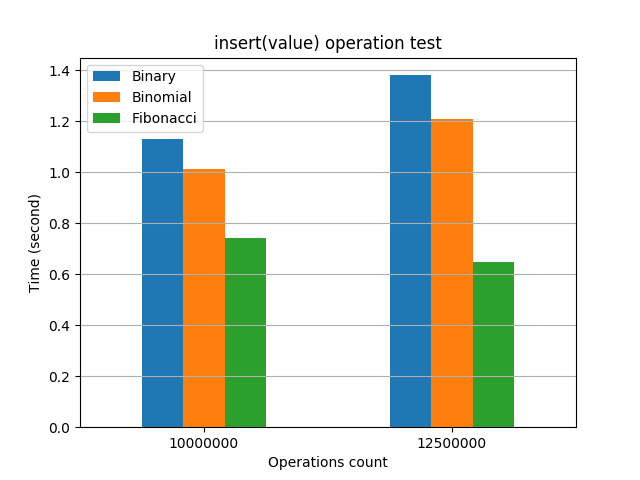
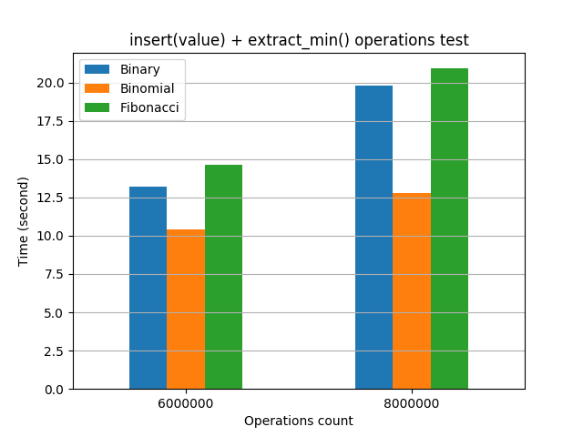
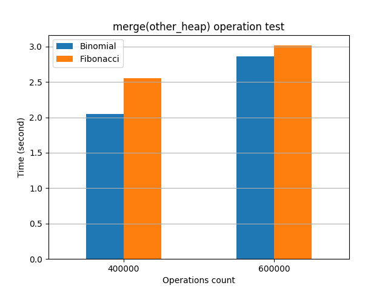
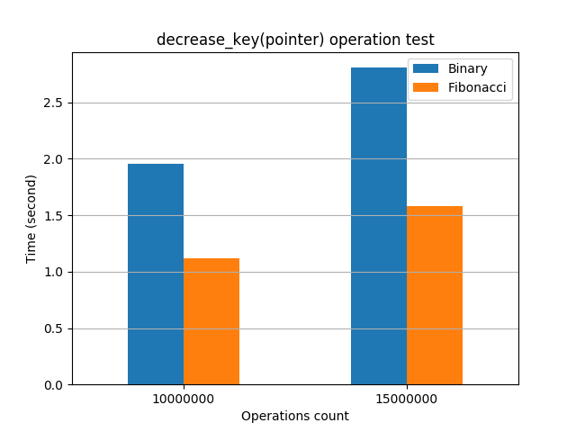
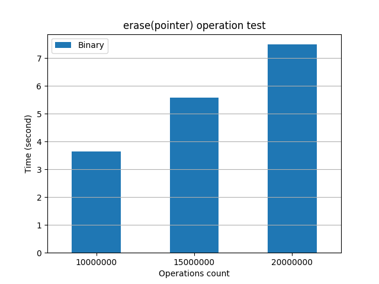

[](https://travis-ci.org/Denisson001/asd2018_test)

# Heaps gallery
- Binary heap
- Binomial heap
- Fibonacci heap

# Usage example

Скомпилировать все исходные файлы.

```
bash compile_main
```

Скомпилировать тесты.

**Для этой опции должен быть установлен `Boost`.**

```
bash compile_tests
```

Запустить тесты.

```
bash run_tests
```

Построить графики по полученной из тестов статистике.

**Для этой опции должны быть установлены модули `pandas`, `matplotlib` для python.**

```
bash draw_result.sh
```

# Unit tests

Использую `Boost unit_test_framework` для юнит тестирования.

# Load tests

- **Test 1:** посмотрим на производительность всех трех куч при операции `insert(value)`. Эта операция работает за *O(1)* у фибоначчиевой кучи и за *O(logN)* у двух остальных куч. Это мы и видим на графике.



- **Test 2:** посмотрим на производительность всех трех куч при операциях `insert(value) + extract_min()`. Операция `extract_min()` у всех куч работает за *O(logN)*. Из графика видно, что при размере инпута до `5*10^5` лучше использовать бинарную кучу, а при размере инпута `10^6` и больше - биномиальную кучу. Фибоначчиева куча проигрывает из-за своей константы.



- **Test 3:** сравним производительность биномиальной и фибоначчиевой куч при операции `merge(other_heap)`. Эта перация у биномиальной кучи работает за *O(logN)*, а у фибоначчиевой за *O(1)*. Но по графику видно, что фибоначчиева куча не дает должного прироста производительности из-за своей константы.



- **Test 4:** сравним производительность бинарной и фибоначчиевой куч при операции `decrase_key(pointer)`. Эта операция у бинарной кучи работает за *O(logN)*, а у фибоначчиевой за *O(1)*. По графику видно, что бинарная куча действительно уступает в производительности фибоначчиевой.



- **Test 5:** посмотрим на производительность бинарной кучи при операции `erase(pointer)`. Эта операция у бинарной кучи работает за *O(logN)*.



# Stress tests

- **Test 1:** посмотрим на производительность всех трех куч при большой нагрузке при операции `insert(value)`. Фибоначчиева куча начинает работать в два раза быстрее бинарной.



- **Test 2:** посмотрим на производительность всех трех куч при большой нагрузке при операциях `insert(value) + extract_min()`. Бинарная и фибоначчиева кучи сильно уступают биномиальной.



- **Test 3:** сравним производительность биномиальной и фибоначчиевой куч при большой нагрузке при операции `merge(other_heap)`. Фибоначчиева куча начинает работать медленнее биномиальной.



- **Test 4:** сравним производительность бинарной и фибоначчиевой куч  при большой нагрузке при операции `decrase_key(pointer)`. Бинарная куча уступает фибоначчиевой в два раза.



- **Test 5:** посмотрим на производительность бинарной кучи при большой нагрузке при операции `erase(pointer)`.


