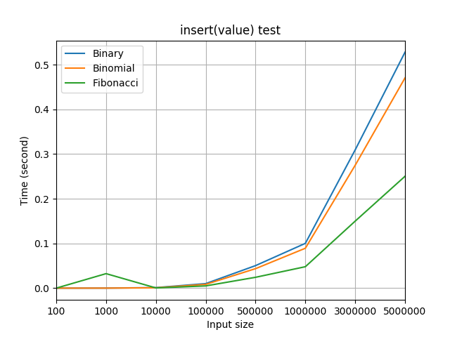

# Heaps gallery
- Binary heap
- Binomial heap
- Fibonacci heap

# Usage example

Скомпилировать все исходные файлы.

```
bash compile_main
```

Скомпилировать тесты.

```
bash compile_tests
```

Запустить тесты.

```
bash run_tests
```

Построить графики по полученной из тестов статистике.

** Для это опции должны быть установлены модули `pandas`, `matplotlib` для *python*. **

```
bash draw_result.sh
```
# Load tests

- *Test 1:* посмотрим на производительность всех трех куч при операции `insert(value)`. Эта операция работает за *O(1)* у фибоначчиевой кучи и за *O(logN)* у двух остальных куч. Это мы и видим на графике.


