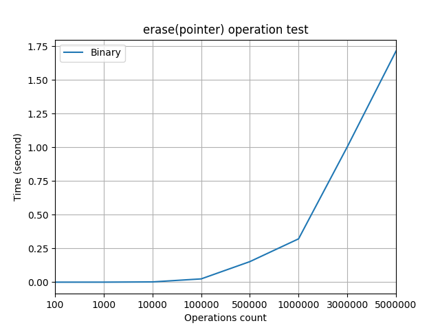

[](https://travis-ci.org/Denisson001/asd2018_test)

- #### [Unit tests](#Unit tests)
- #### [Stress tests](#Stress tests)
- #### [Usability tests](#Usability tests)

# Heaps gallery
- Binary heap
- Binomial heap
- Fibonacci heap

# Usage example

Скомпилировать все исходные файлы.

```
bash compile_main
```

Скомпилировать тесты.

**Для этой опции должен быть установлен `Boost`.**

```
bash compile_tests
```

Запустить тесты.

```
bash run_tests
```

Построить графики по полученной из тестов статистике.

**Для этой опции должны быть установлены модули `pandas`, `matplotlib` для python.**

```
bash draw_result.sh
```

# Unit tests

Использую `Boost unit_test_framework` для юнит тестирования.

# Load tests

- **Test 1:** посмотрим на производительность всех трех куч при операции `insert(value)`. Эта операция работает за *O(1)* у фибоначчиевой кучи и за *O(logN)* у двух остальных куч. Это мы и видим на графике.


- **Test 2:** посмотрим на производительность всех трех куч при операциях `insert(value) + extract_min()`. Операция `extract_min()` у всех куч работает за *O(logN)*. Из графика видно, что при размере инпута до `5*10^5` лучше использовать бинарную кучу, а при размере инпута `10^6` и больше - биномиальную кучу. Фибоначчиева куча проигрывает из-за своей константы.


- **Test 3:** сравним производительность биномиальной и фибоначчиевой куч при операции `merge(other_heap)`. Эта перация у биномиальной кучи работает за *O(logN)*, а у фибоначчиевой за *O(1)*. Но по графику видно, что фибоначчиева куча не дает должного прироста производительности из-за своей константы.


- **Test 4:** сравним производительность бинарной и фибоначчиевой куч при операции `decrase_key(pointer)`. Эта операция у бинарной кучи работает за *O(logN)*, а у фибоначчиевой за *O(1)*. По графику видно, что бинарная куча действительно уступает в производительности фибоначчиевой.


- **Test 5:** посмотрим на производительность бинарной кучи при операции `erase(pointer)`. Эта операция у бинарной кучи работает за *O(logN)*.



# Stress tests

- **Test 1:** посмотрим на производительность всех трех куч при большой нагрузке при операции `insert(value)`. Фибоначчиева куча начинает работать в два раза быстрее бинарной.


- **Test 2:** посмотрим на производительность всех трех куч при большой нагрузке при операциях `insert(value) + extract_min()`. Бинарная и фибоначчиева кучи сильно уступают биномиальной.


- **Test 3:** сравним производительность биномиальной и фибоначчиевой куч при большой нагрузке при операции `merge(other_heap)`. Фибоначчиева куча начинает работать медленнее биномиальной.


- **Test 4:** сравним производительность бинарной и фибоначчиевой куч  при большой нагрузке при операции `decrase_key(pointer)`. Бинарная куча уступает фибоначчиевой в два раза.


- **Test 5:** посмотрим на производительность бинарной кучи при большой нагрузке при операции `erase(pointer)`.


# Usability tests

Посмотрим скольким эвристикам соответствует интерфейс согласно списку из ***[wiki: Юзабилити](https://ru.wikipedia.org/wiki/%D0%AE%D0%B7%D0%B0%D0%B1%D0%B8%D0%BB%D0%B8%D1%82%D0%B8#%D0%9F%D1%80%D0%B8%D0%BD%D1%86%D0%B8%D0%BF%D1%8B_%D0%BE%D0%B1%D0%B5%D1%81%D0%BF%D0%B5%D1%87%D0%B5%D0%BD%D0%B8%D1%8F_%D1%83%D0%B4%D0%BE%D0%B1%D1%81%D1%82%D0%B2%D0%B0_%D0%B8%D1%81%D0%BF%D0%BE%D0%BB%D1%8C%D0%B7%D0%BE%D0%B2%D0%B0%D0%BD%D0%B8%D1%8F)***:

- **Согласованность и стандарты**: названия и сигнатуры всех внешних методов говорят сами за себя, также есть документация ниже.

- **Гибкость и эффективность использования**: исходная цель проекта - предоставить алгоритмы для использования в качестве черного ящика. Поэтому гибкость системы не предполагалась изначально.

- **Эстетический и минималистический дизайн**: в качестве интерфейса представлены только те команды, которые реально могут потребоваться от алгоритма. Все внутренние методы сокрыты.

- **Помочь пользователю понять и исправить ошибку**: все возможные ошибки - вылетающие исключения, логика которых очевидна.

- **Справка и документация:** названия функций соответствуют общепринятым, поэтому возможно использование алгоритмов в качестве черного ящика. Тем не менее присутствует документация:

## Binary heap

Реализация бинарной кучи. Поддерживаются следующие операции:

- ***insert(key)*** - вставить значение в кучу. Возвращает специальный указатель на этот элемент в куче.
- ***get_min()*** - возвращает минимальное значение в куче. Если куча пуста, то бросается исключение.
- ***extract_min()*** - возвращает минимальное значение в куче и удаляет его из кучи. Если куча пуста, то бросается исключение.
- ***is_empty()*** - возвращает *True*, если куча пуста.
- ***erase(pointer)*** - удаляет элемент из кучи по указателю на него.
- ***change(pointer, key)*** - меняет значение элемент кучи, лежащего под указателем в кучи.
- ***get_val(pointer)*** - возвращает значение элемента, лежащего под указателем в кучи.
- ***Binary_heap(Iterator begin, Iterator end)*** - создает бинарную кучу по элементам, лежащих между переданными итераторами.
- ***get_min_key_pointer()*** - возвращает указатель на минимальный элемент в куче.

Временная сложность операций:

- ***insert(key)*** - *O(logN)*.
- ***get_min()*** - *O(1)*.
- ***extract_min()*** - *O(logN)*.
- ***is_empty()*** - *O(1)*.
- ***erase(pointer)*** - *O(logN)*.
- ***change(pointer, key)*** - *O(logN)*.
- ***get_val(pointer)*** - *O(1)*.
- ***Binary_heap(Iterator begin, Iterator end)*** - *O(distance(begin, end))*.
- ***get_min_key_pointer()*** - *O(1)*

## Binomial heap

Реализация биномиальной кучи. Поддерживаются следующие операции:

- ***insert(key)*** - вставить значение в кучу.
- ***get_min()*** - возвращает минимальное значение в куче. Если куча пуста, то бросается исключение.
- ***extract_min()*** - возвращает минимальное значение в куче и удаляет его из кучи. Если куча пуста, то бросается исключение.
- ***is_empty()*** - возвращает *True*, если куча пуста.
- ***merge(other_heap)*** - приливает к текущей кучи другую кучу.

Временная сложность операций:

- ***insert(key)*** - *O(logN)*.
- ***get_min()*** - *O(1)*.
- ***extract_min()*** - *O(logN)*.
- ***is_empty()*** - *O(1)*.
- ***merge()*** - *O(logN)*

## Fibonacci heap

Реализация фибоначчиевой кучи. Поддерживаются следующие операции:

- ***insert(key)*** - вставить значение в кучу. Возвращает специальный указатель на этот элемент в куче.
- ***get_min()*** - возвращает минимальное значение в куче. Если куча пуста, то бросается исключение.
- ***extract_min()*** - возвращает минимальное значение в куче и удаляет его из кучи. Если куча пуста, то бросается исключение.
- ***is_empty()*** - возвращает *True*, если куча пуста.
- ***decrease(pointer, key)*** - уменьшает значение элемент кучи, лежащего под указателем в кучи, до переданного. Если переданное значение больше текущего, то бросается исключение.
- ***get_val(pointer)*** - возвращает значение элемента, лежащего под указателем в кучи.
- ***merge(other_heap)*** - приливает к текущей кучи другую кучу.
- ***get_min_key_pointer()*** - возвращает указатель на минимальный элемент в куче.

Временная сложность операций:

- ***insert(key)*** - *O(1)*.
- ***get_min()*** - *O(1)*.
- ***extract_min()*** - *O(logN)*.
- ***is_empty()*** - *O(1)*.
- ***decrease(pointer, key)*** - *O(1)*.
- ***get_val(pointer)*** - *O(1)*.
- ***merge()*** - *O(1)*
- ***get_min_key_pointer()*** - *O(1)*

---

- Также посмотрим на возможное реальное применение фибоначчиевой кучи в качестве черного ящика. Реализуем алгоритм Дейкстры и сравним с ***[псевдокодом](https://en.wikipedia.org/wiki/Dijkstra's_algorithm#Using_a_priority_queue)***.

```c++
#include "Fibonacci_heap.cpp"
#include <vector>
#include <iostream>

const int N = 1e5;
const int INF = 1e9 + 7;

std::vector<std::pair<int, int>> g[N];
int dist[N];
Fibonacci_heap<std::pair<int, int>> heap;
Pointer_fibonacci_heap<std::pair<int, int>> pointers[N];

int main(){
   int V, E, start;
   std::cin >> V >> E >> start;
   for (int i = 0; i < E; i++){
      int s, t, w;
      std::cin >> s >> t >> w;
      g[s].push_back(std::make_pair(t, w));
   }

   for (int i = 1; i <= V; i++){
      if (i == start){
         dist[i] = 0;
      } else {
         dist[i] = INF;
      }
      pointers[i] = heap.insert(std::make_pair(dist[i], i));
   }

   while(!heap.is_empty()){
      auto [value, v] = heap.extract_min();
      for (auto [to, w] : g[v]){
         if (dist[to] > value + w){
            dist[to] = value + w;
            heap.decrease(pointers[to], std::make_pair(dist[to], to));
         }
      }
   }

   for (int i = 1; i <= V; i++){
      std::cout << i << ' ' << dist[i] << "\n";
   }
}
```

Видим, что реальный код не сильно отличается от псевдокода. Это может означать, что практическая реализация алгоритма не утяжелена какими-либо техническими вещами по сравнению с идейной частью алгоритма.
